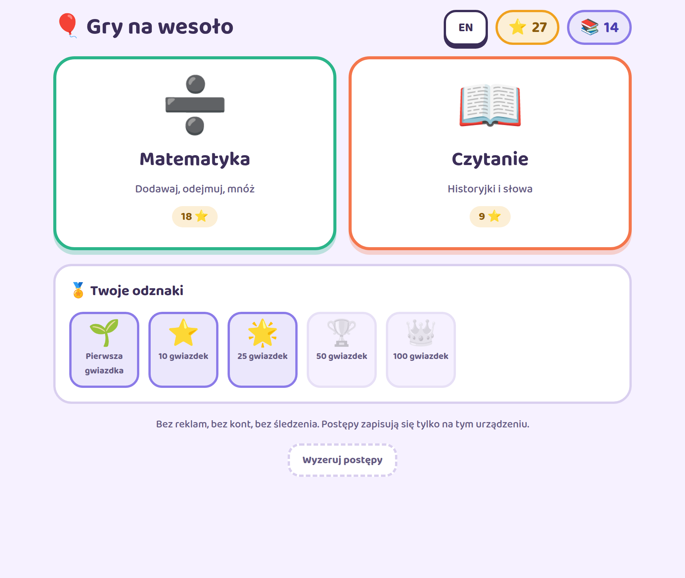
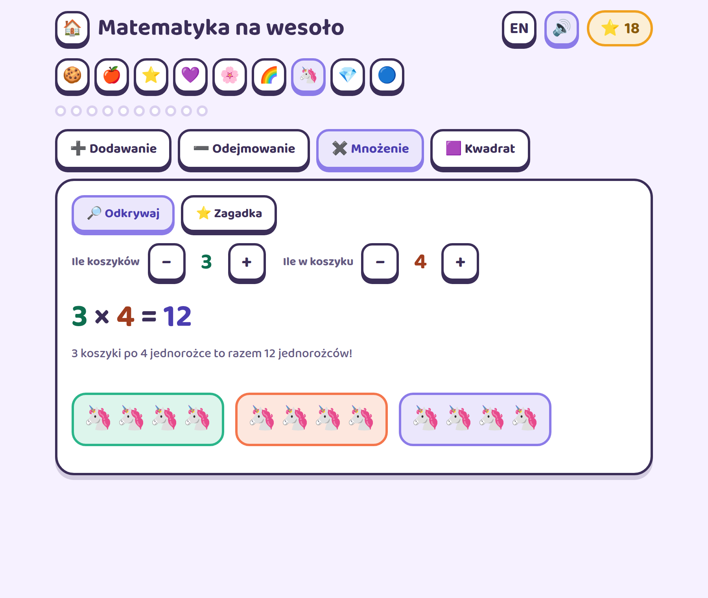
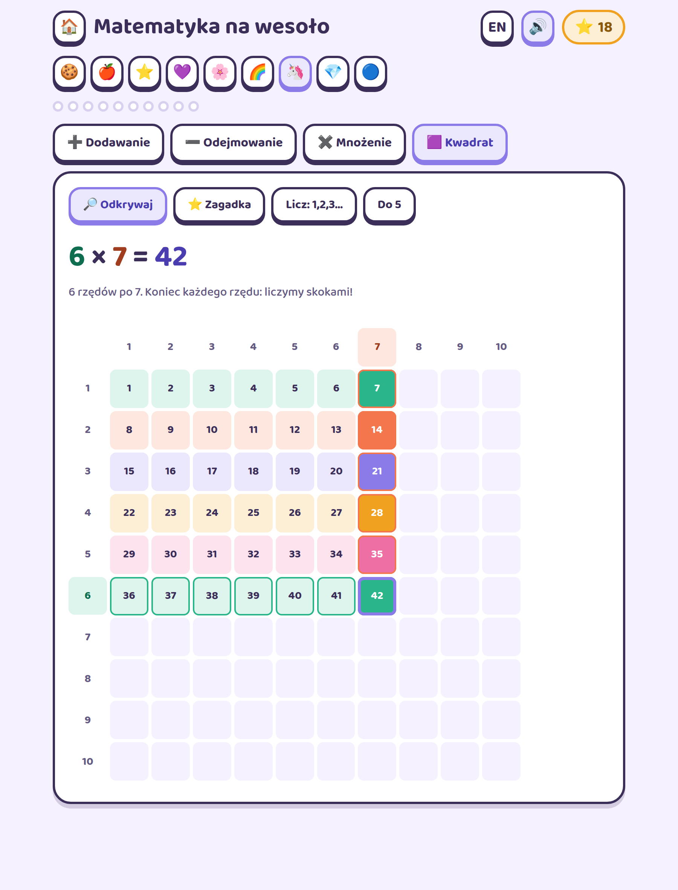
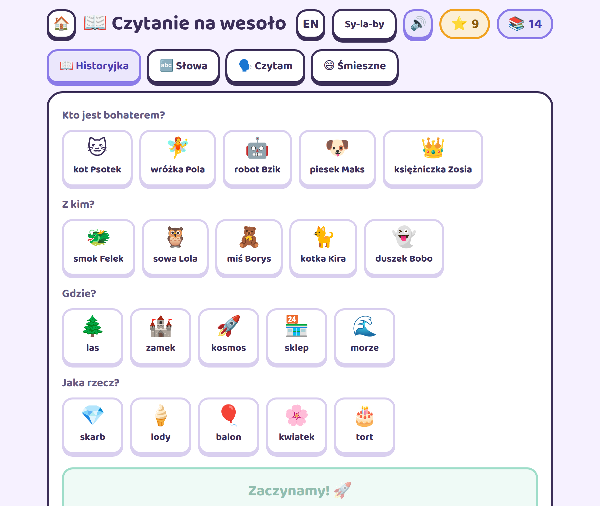
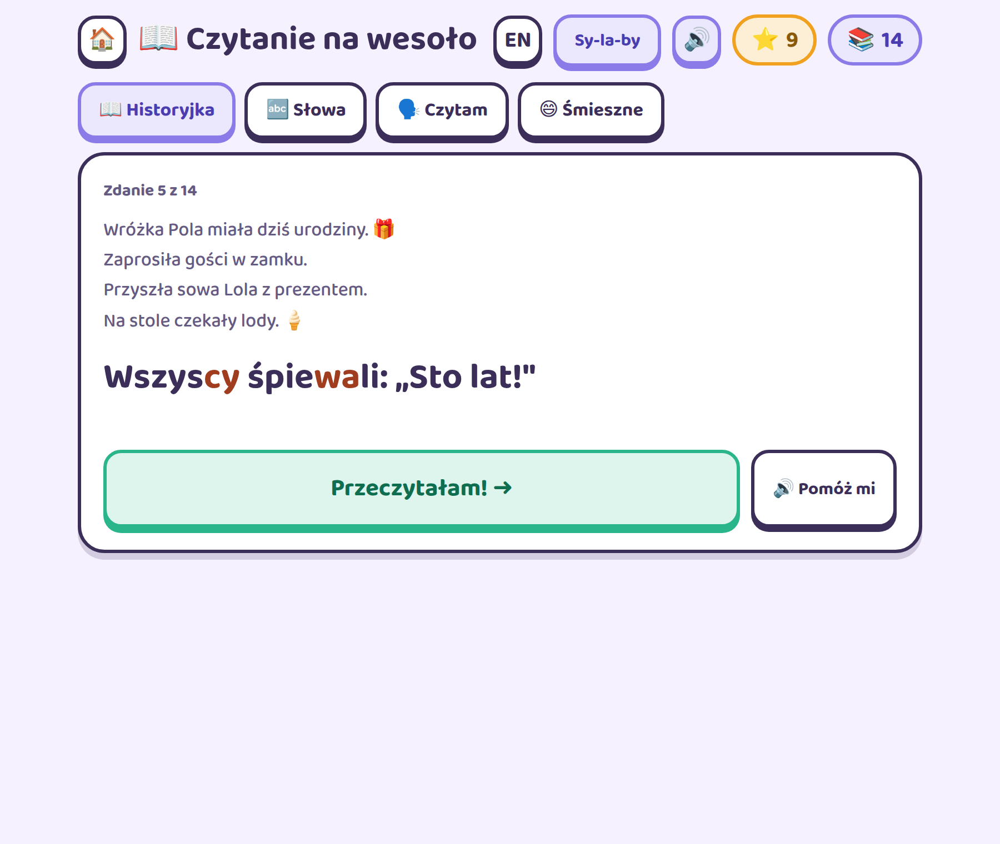
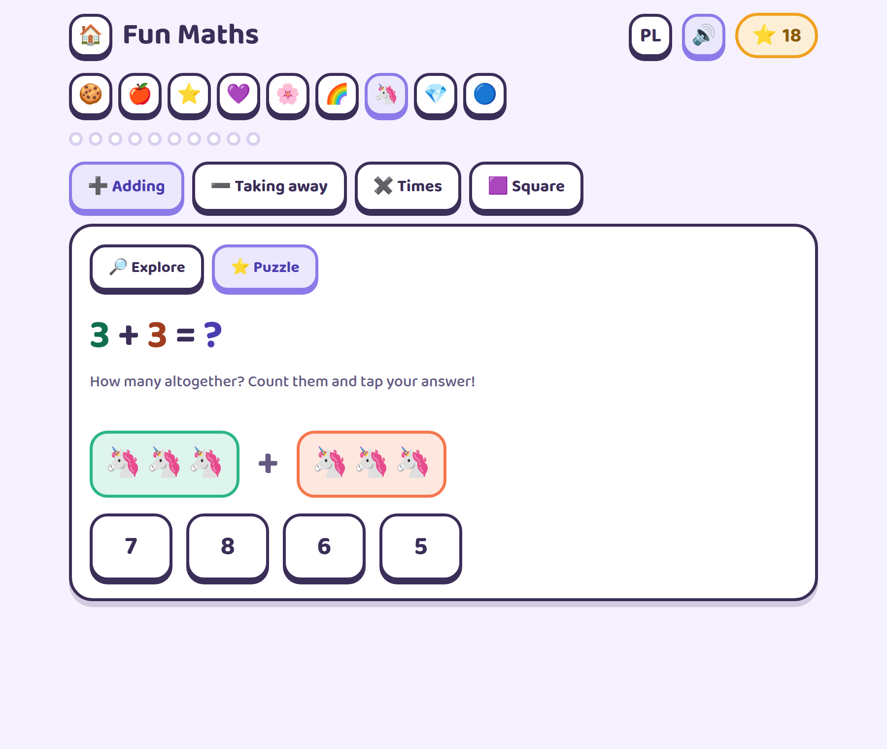
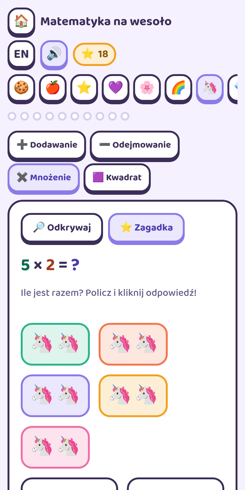
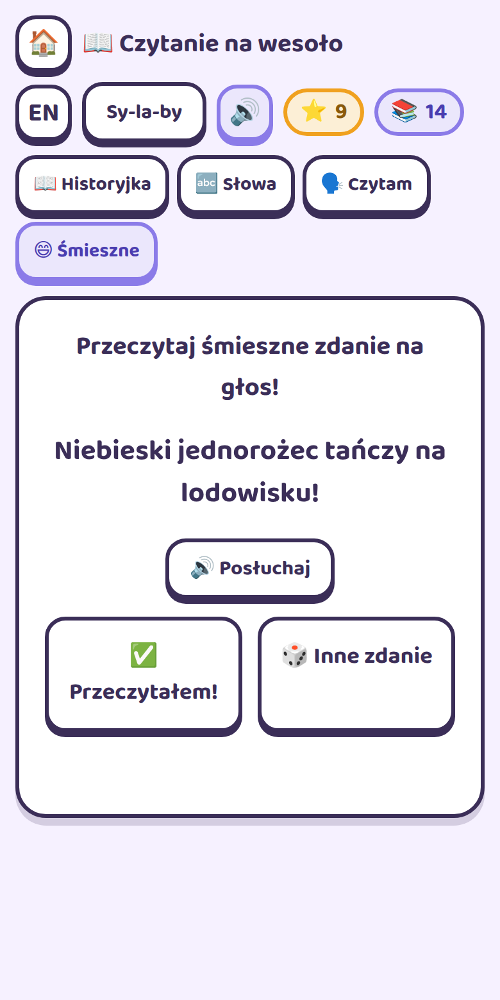

# 🎈 Gry na wesoło — Fun Games

Maths and early-reading games for children roughly aged 5–8, in **Polish and English**.
No ads, no accounts, no tracking, no analytics. Works offline. Progress lives in the
browser on one device and never leaves it.

Built for one six-year-old, then cleaned up enough to hand to anyone else's.



---

## What's in it

### ➗ Matematyka / Maths

Four ways in, each with an **Explore** mode the child drives and a **Puzzle** mode that asks
questions. Every problem is a picture before it is a number: you count unicorns in baskets,
watch them disappear, or fill in a rectangle.

| | |
|---|---|
| **➕ Adding** | Two baskets, filled one item at a time while the running total climbs |
| **➖ Taking away** | One basket; items grey out as they go |
| **✖️ Times** | *n* baskets of *m* — the model that makes multiplication mean something |
| **🟪 Square** | The area model on a 10×10 board, either skip-counting or as products |



The area model is the one to look at. Tap any square and the rectangle fills in cell by cell,
so `6 × 7` is a shape you can see rather than a fact to memorise:



**Questions adapt.** Every fact the child meets is remembered as `{seen, wrong}`, and the
sampler leans towards facts that are new or shaky. A child who has mastered ×2 stops being
asked ×2 quite so often.

**Rounds have an end.** Ten questions fill ten dots, a streak counter tracks the run, and the
round finishes with a celebration — rather than streaming forever.

### 📖 Czytanie / Reading

The child picks a hero, a friend, a place and a thing; the story is assembled around those
choices, one sentence at a time, with a comprehension quiz at the end.



**Syllable mode** colours alternate syllables, which is how Polish children are taught to
decode. It applies everywhere: stories, word matching, the flashcards and the silly sentences.



Plus three practice modes: 🔤 **Words** (match the picture to the spelling), 🗣️ **I read**
(flashcards to read out loud), and 😄 **Funny** (randomly assembled silly sentences —
*"A dancing dog laughs in a hat!"*).

Every story sentence and every word can be read aloud by the browser's speech synthesis.

### Two currencies, on purpose

⭐ **Stars** are earned only by answering something the app can actually check.
📚 **Pages read** come from the self-graded modes, where the child taps *"I read it!"*.
Badges key off stars alone, so tapping through the flashcards cannot mint a crown.

### 🇵🇱 / 🇬🇧 Bilingual throughout

One toggle switches the interface, the content and the speech-synthesis voice, on every page.



### 📱 Works on a phone, works offline

Installable as a PWA. Once visited, it keeps working with no connection — which is the point,
for a game played in the back of a car.

<p align="center">
  
  
</p>

### ♿ Accessible

Zero WCAG 2.1 AA violations on every page and every mode, checked in CI with axe. The 10×10
board is a real `role="grid"` of `<button>`s with arrow-key navigation; tab strips are real
ARIA tablists; results are announced through live regions; motion respects
`prefers-reduced-motion`; nothing scrolls sideways at 360 px.

---

## Running it

```bash
npm install
npm run dev        # http://localhost:5173
npm run build      # static files in dist/
npm run preview    # serve the build on :4599
```

The build is plain static files — host them anywhere.

## Testing

```bash
npm test           # unit tests (Vitest)
npm run test:e2e   # browser tests (Playwright, needs a build first)
npm run test:all   # unit + build + e2e
```

Three layers:

- **Unit** — the store (star accounting, badge thresholds, v1 migration, corrupt payloads,
  storage that refuses to write), Polish pluralisation including the 12–14 exception,
  syllable rendering, the adaptive sampler, distractor generation, and the story generator
  exercised across **all 625 hero × friend × place × thing combinations in both languages**,
  asserting no `undefined` leaks, no missing or doubled spaces, no run-together words.
- **DOM** — tablist semantics and keyboard behaviour, round and streak bookkeeping.
- **E2E** — full journeys on desktop and mobile viewports, an axe pass on every page and
  mode, plus a regression test pinned to each bug listed below.

## Architecture

Vite + vanilla ES modules. No framework: the interesting complexity here is timed reveal
animations, Web Audio scheduling and grid painting, which a component layer wraps rather than
simplifies. Zero runtime dependencies.

```
src/
  core/      store, audio, i18n, speech, scheduler, confetti, DOM helpers, PWA
  ui/        design tokens + accessible tabs, round/streak, star counters, toasts
  games/
    math/    countingMode factory (+ − ×), area grid, adaptive facts, answer options
    reading/ pure story assembly, syllable text rendering
  content/   PL and EN content packs and copy, separate from the code
  entries/   one module per page
tests/       unit · e2e
```

Two things shape it:

**`countingMode.js`** — addition, subtraction and multiplication were three near-identical
functions differing only in operator, ranges, hint wording and whether items appear or grey
out. They are now one factory, so adding division is a config object rather than a fourth copy.

**`content/`** — the story corpus is data, not code, so it can be extended without touching
game logic, and the generator is a pure function you can property-test exhaustively.

See [docs/ANALYSIS.md](docs/ANALYSIS.md) for the audit this rewrite came from.

## Adding content

Stories, words and silly sentences live in `src/content/pl/reading.js` and
`src/content/en/reading.js`. `|` marks a syllable boundary. Add a hero, a place or a whole
story and the tests will tell you if any combination reads badly.

## Privacy

No network requests after load. No cookies, no analytics, no accounts, no third parties —
the typeface is bundled rather than fetched from Google Fonts. Progress is a single
`localStorage` key on the device, cleared by the Reset button.

## License

[MIT](LICENSE).
